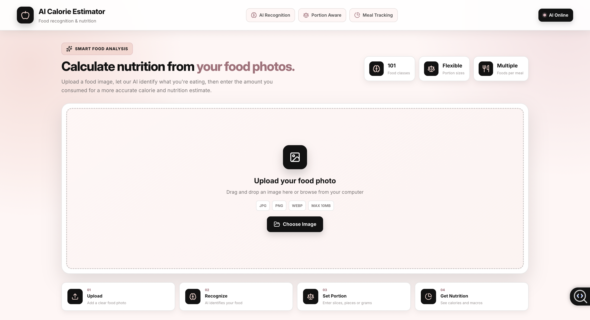
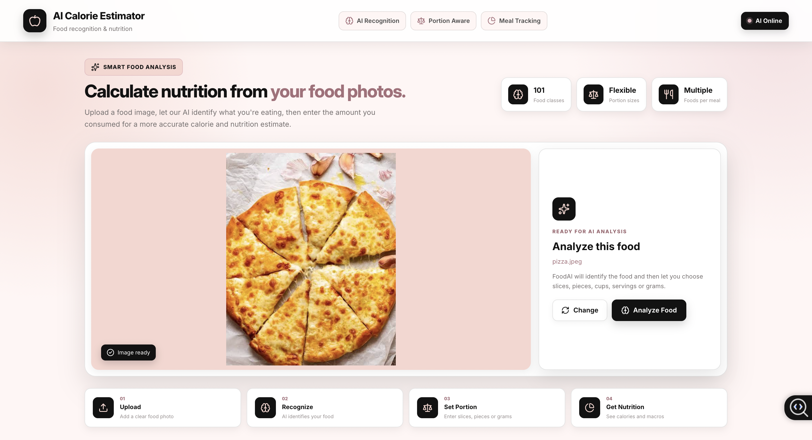
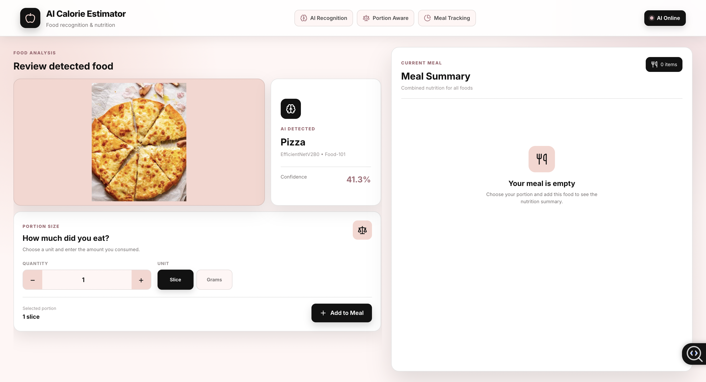
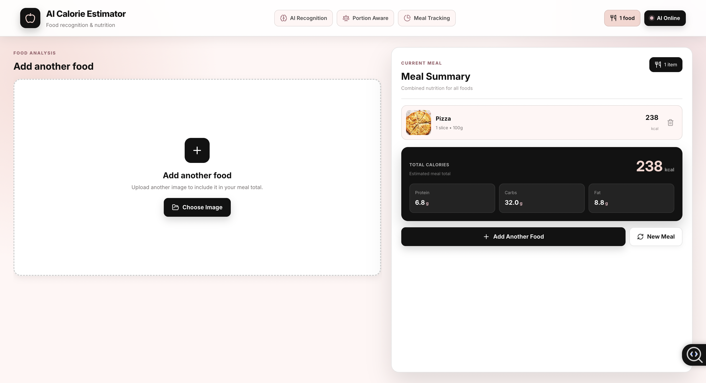

# 🍎 AI Calorie Estimator

An AI-powered full-stack application that identifies food from images and estimates calories and macronutrients based on the portion consumed.

The application uses **EfficientNetV2B0 trained on Food-101** for food recognition, **FastAPI** for the backend, **React** for the frontend, and **USDA FoodData Central** for nutrition information.



## ✨ Features

- 📸 Upload food images using drag and drop
- 🧠 AI-powered food recognition
- 🎯 Food prediction confidence score
- ⚖️ Portion-based calorie estimation
- 🍕 Supports slices, pieces, cups, servings, and grams
- ➕ Add multiple foods to one meal
- 🔥 Automatic total calorie calculation
- 💪 Protein, carbohydrates, and fat tracking
- 🥗 Nutrition data integration with USDA FoodData Central
- 📱 Responsive modern React interface

## 🖥️ Application Preview

### Food Recognition

Upload a food image and the trained AI model predicts the food class.



The prediction pipeline uses an **EfficientNetV2B0** model trained using the **Food-101 dataset containing 101 food categories**.

### Portion-Based Nutrition

Instead of assuming a fixed serving size, the application asks the user how much food was actually consumed.



Depending on the food, users can enter quantities using units such as:

- Slices
- Pieces
- Cups
- Servings
- Grams

The selected portion is converted to grams before the nutrition estimate is calculated.

### Multi-Food Meal Calculator

Users can analyze multiple foods and combine them into a single meal.



The meal summary automatically calculates:

- Total calories
- Protein
- Carbohydrates
- Fat

Individual foods can also be removed from the meal.

## 🧠 How It Works

```text
Food Image
    │
    ▼
React Frontend
    │
    │ Image Upload
    ▼
FastAPI Backend
    │
    ▼
EfficientNetV2B0
    │
    │ Food Prediction
    ▼
Predicted Food + Confidence
    │
    ▼
User Selects Portion
    │
    ▼
Portion Converted to Grams
    │
    ▼
USDA FoodData Central
    │
    ▼
Nutrition Calculation
    │
    ▼
Meal Summary
```

## 🛠️ Tech Stack

### Frontend

- React
- Vite
- JavaScript
- CSS
- Lucide React

### Backend

- Python
- FastAPI
- Uvicorn
- Pydantic
- Python Multipart

### AI / Machine Learning

- TensorFlow
- Keras
- EfficientNetV2B0
- Transfer Learning
- Fine-Tuning
- NumPy
- Pillow

### Dataset

- Food-101
- 101 food categories

### Nutrition Data

- USDA FoodData Central API

## 🏗️ Project Structure

```text
ai-food-calorie-estimator/
│
├── ai-model/
│   ├── config/
│   │   └── food101_class_names.json
│   ├── data/
│   │   └── download_dataset.py
│   ├── inference/
│   ├── models/
│   └── training/
│       └── train.py
│
├── backend/
│   └── app/
│       ├── api/
│       │   └── routes.py
│       ├── services/
│       │   ├── ai_service.py
│       │   ├── nutrition_service.py
│       │   └── portion_service.py
│       └── main.py
│
├── frontend/
│   ├── public/
│   └── src/
│       ├── components/
│       │   ├── ImageUpload.jsx
│       │   └── ImageUpload.css
│       ├── services/
│       │   └── api.js
│       └── App.jsx
│
├── docs/
│   └── images/
│
├── requirements.txt
└── README.md
```

## 🤖 AI Model

The food classification model uses **EfficientNetV2B0** with transfer learning.

### Training Pipeline

```text
Food-101 Dataset
      │
      ▼
Image Preprocessing
      │
      ▼
Data Augmentation
      │
      ▼
EfficientNetV2B0
      │
      ▼
Transfer Learning
      │
      ▼
Fine-Tuning
      │
      ▼
101-Class Food Classifier
```

The trained model receives an uploaded food image and returns:

```json
{
  "food": "pizza",
  "confidence": 94.82
}
```

The prediction is then passed to the nutrition pipeline.

## ⚖️ Portion Estimation

Food recognition alone cannot determine exactly how much food was consumed.

For this reason, the application separates:

```text
What food is this?
        +
How much did the user eat?
        =
Estimated nutrition
```

For example:

```text
Detected Food: Pizza
Confidence: 96%

Quantity: 2
Unit: Slices

Converted Portion: ~200g
```

The backend then calculates nutrition for the selected portion.

> Portion conversions such as slices or pieces are estimates and can vary depending on the actual food size. Users can select grams when a more precise weight is known.

## 🥗 Nutrition Integration

Nutrition information is retrieved using the **USDA FoodData Central API**.

The application currently tracks:

```text
Calories
Protein
Carbohydrates
Fat
```

Example response:

```json
{
  "food": "pizza",
  "quantity": 2,
  "unit": "slice",
  "grams": 200,
  "nutrition": {
    "calories": 532,
    "protein": 22.4,
    "carbohydrates": 66.8,
    "fat": 19.6
  }
}
```

## 🔌 API Endpoints

### Analyze Food Image

```http
POST /api/upload
```

Request:

```text
multipart/form-data
file=<food-image>
```

Response:

```json
{
  "food": "pizza",
  "confidence": 94.82,
  "portion_options": [
    {
      "value": "slice",
      "label": "Slice",
      "grams": 100
    },
    {
      "value": "gram",
      "label": "Grams",
      "grams": 1
    }
  ]
}
```

### Calculate Nutrition

```http
POST /api/nutrition
```

Request:

```json
{
  "food_name": "pizza",
  "unit": "slice",
  "quantity": 2
}
```

## 🚀 Running the Project Locally

### 1. Clone the Repository

```bash
git clone <your-repository-url>
cd ai-food-calorie-estimator
```

### 2. Create Python Virtual Environment

```bash
python3 -m venv venv
source venv/bin/activate
```

### 3. Install Backend Dependencies

```bash
pip install -r requirements.txt
```

### 4. Configure Environment Variables

Create a `.env` file in the project/backend environment used by the application.

```env
USDA_API_KEY=your_usda_api_key
```

Do not commit `.env` to GitHub.

### 5. Start FastAPI

```bash
cd backend
uvicorn app.main:app --reload
```

Backend:

```text
http://127.0.0.1:8000
```

### 6. Install Frontend Dependencies

Open another terminal:

```bash
cd frontend
npm install
```

Create:

```text
frontend/.env
```

Add:

```env
VITE_API_URL=http://127.0.0.1:8000
```

### 7. Start React

```bash
npm run dev
```

Frontend:

```text
http://localhost:5173
```

## 🔐 Environment Variables

Sensitive credentials are stored using environment variables rather than directly inside the source code.

```text
USDA_API_KEY
VITE_API_URL
```

The `.env` files are excluded through `.gitignore`.

## 📈 Future Improvements

Planned improvements include:

- More accurate food-specific portion conversions
- USDA serving-size normalization
- Improved nutrition result matching
- Multi-food detection from a single image
- Meal history
- User accounts
- Daily calorie tracking
- Nutrition dashboard
- Model accuracy evaluation dashboard
- Automated tests
- Docker support
- Cloud deployment

## ⚠️ Disclaimer

Nutrition values generated by this application are estimates. Actual calories and macronutrients can vary based on ingredients, preparation method, recipe, brand, and portion size.

The application is intended as an AI/software engineering project and should not be treated as medical or dietary advice.

## 👩‍💻 Author

**Rachana Sudhakar**

Built as a full-stack AI project combining machine learning, backend API development, third-party API integration, and modern frontend development.